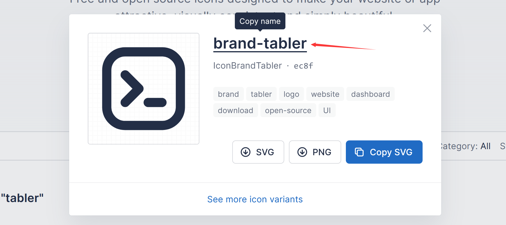

## 緒

鳴鈴曾經建過的 blog 也不少，用過 [WordPress](https://www.wordpress.com), [Typecho](https://typecho.org) 等基於 PHP 的 blog 軟體，最近也用過 [Hexo](https://hexo.io) 這種靜態頁面的 blog 軟體，最終因爲一些鳴鈴不願意透露的原因選擇了當前的 [Hugo](https://gohugo.io/).

爲了省錢，敝站完全使用 Github 來構建，因此對於落魄的鳴鈴來講十分合適 (

## Blog 程式

Hugo 類似於 $\LaTeX$ 將 `.tex` 檔案編譯爲 `.dvi` 或者 `.pdf`，其可以將十分利於人類讀寫的 Markdown 檔案編譯爲 blog 所需的靜態網頁.

具體的使用方法可見於[此](https://gohugo.io/documentation/)

## 部署

在編輯完成 Blog 後，使用 `hugo server` 以編譯，hugo 會將網站輸出在 `\public` 目錄下。如果你有虛擬主機或者雲伺服器的話，便可以使用 Nginx 或者 Apache 之類的網頁伺服器來部署你的網頁了。

但鳴鈴使用 [Github Pages](https://pages.github.com/) 來承載網站，並使用 [Github Actions](https://github.com/features/actions) 來實現自動化部署到 Github Pages 上.

### Github Pages

### Github Actions

## 留言

敝站的留言功能由 [utterances 🔮](https://utteranc.es/) 提供，當然也是完全基於 Github 的。因此 utterances 只支持 Github 的登錄用戶留言，如果不能忍受這一點可以選擇其他產品如 disqus 等。

其利用了 Github 的 issues 作爲資料存儲，因此需要一個 public Github repository 以存放留言的 issues，爲了方便管理留言以免真正的 issue 和留言混在一起，鳴鈴推薦你新建一個專用的 repository 給 utterances 使用。blog 中每一個可以留言的頁面都將映射成一個 issue，而留言內容就存儲在對應 issue 的對話串中。因此你可以指定頁面的索引格式，用來設定 blog 的貼文以何種方式映射至 Github issues.

要想安裝 utterances ，首先你需要爲 repository 安裝 [utterances 插件](https://github.com/apps/utterances)，這個插件的作用是將用戶的留言儲存至相關頁面的 issue 中。

然後你需要在 blog 端配置 utterances 的客戶端，如果你的主題原生的支援 utterances ，你只需要按照主題作者提供的配置格式來配置即可。如若不然，你需要手動爲 hugo 添加 utterances 支援。

在 [utterances 官網](https://utteranc.es/)內你可以詳細配置你的客戶端 repository，條目索引，主題等設定項，而後在下方能獲得類似這樣的代碼片段: 
```html
<script src="https://utteranc.es/client.js"
        repo="[ENTER REPO HERE]"
        issue-term="pathname"
        theme="github-light"
        crossorigin="anonymous"
        async>
</script>
```

將這段代碼複製到 hugo 需要有留言區的頁面的 head 中即可，具體方法可以閱讀 hugo 的文檔或者參考有相關功能的主題。

## 擴展功能

敝站使用 hugo 提供的 [shortcode template](https://gohugo.io/templates/shortcode-templates/) 功能添加了一些 hugo 沒有提供，主題方亦沒有提供的功能。

### svg icon

在本文中可以看到一些行內的小圖標，他們來自於 tabler icons 或 fontawesome. 

要想在 hugo 中便捷地使用這些圖標，首先要在 head 中引入相關的 CSS：

```html
<!--引入 tabler icons-->
<link rel="stylesheet" href="https://unpkg.com/@tabler/icons@latest/iconfont/tabler-icons.min.css">

<!--引入 fontawesome-->
<link rel="stylesheet" href="https://pro.fontawesome.com/releases/v5.10.0/css/all.css"
    integrity="sha384-AYmEC3Yw5cVb3ZcuHtOA93w35dYTsvhLPVnYs9eStHfGJvOvKxVfELGroGkvsg+p" crossorigin="anonymous" />
```

其後，在 `[hugo根目錄]/layouts/shortcodes` 下新建 `ti.html`，並寫入:
```html
{{ $iconid := (.Get 0) }}
<i class="ti ti-{{$iconid}}"></i>
```
就可以得到 tabler 圖標, 打開 [tabler官網](https://tabler-icons.io/)，查找你想要插入的圖標，而後複製圖標的名。



在 `.md` 源碼中你想插入的位置處輸入 `` 即可插入。上圖的例子中你應該輸入 ``。

類似地，在 `[hugo根目錄]/layouts/shortcodes` 下新建 `fa.html`，寫入:

```html
{{ $fi := (.Get 0) }}
{{ $se := (.Get 1) }}
<i class="inline-icon {{$fi}} fa-{{$se}}"></i>
```

就可以得到 font awesome 圖標, 打開 [fontawesome 官網](https://fontawesome.com), 查找你想要插入的圖標，而後複製圖標的分類和名。使用 `` 來插入. 其中 `[圖標分類]` 指的是官網中 `fab` 或者 `fac` 之類的分類。

### 文本摺疊

對於長文本，摺疊的功能是必要的，而 HTML5 新增的 ``

<details>
    深思
</details>

### mermaid